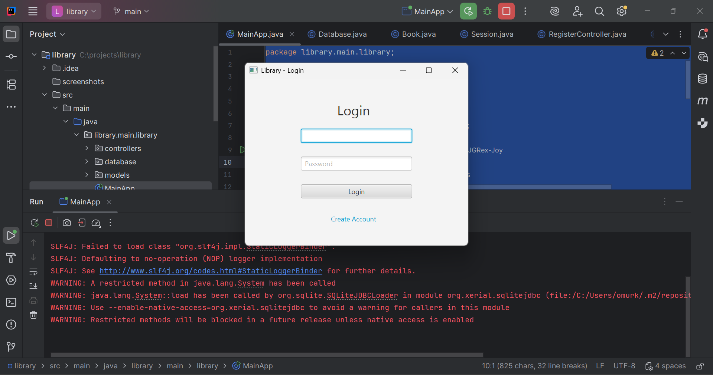
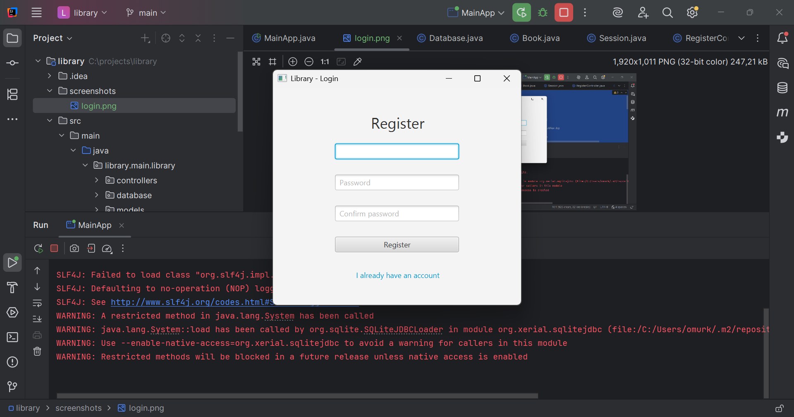
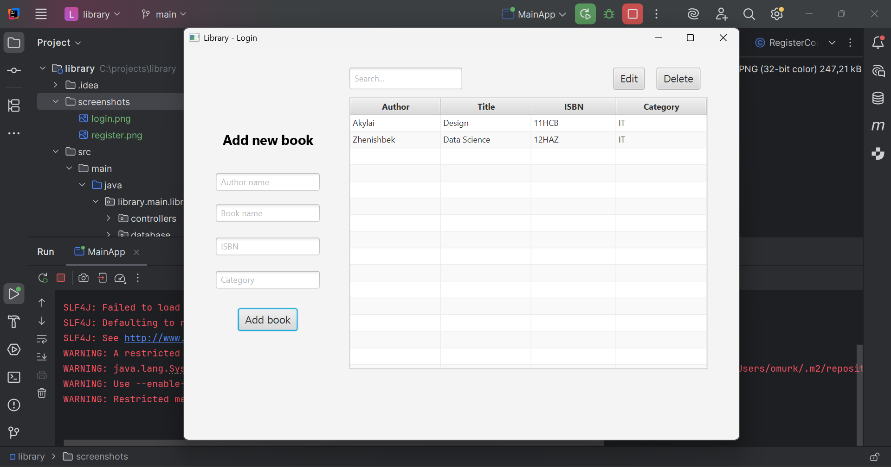

# 📚 Library Management System (JavaFX + SQLite)
A simple Library Management System built with JavaFX, using SQLite as a database.
The system allows users to register, log in, and manage their personal book collection (CRUD operations + search).

Final project for OSE & BAP courses with JavaFX, MVC structure, and database integration.

# Authentication
- User Registration
- User Login
- Password verification
- User-specific data isolation
# Book Management (CRUD)
- Add new books
- Edit books
- Delete books
- View books belonging only to the logged-in user
- Real-time search (author/title/isbn/category)
# UI/UX
- Clean JavaFX interface
- Alerts for validation, errors, and confirmations
- Form auto-population on table row selection
# Technology Stack
````
Component	    Technology
Language	    Java 17+
UI Framework	    JavaFX
Database	    SQLite
Build Tool	    Maven
Architecture	    MVC
````

# Project Structure
````
src/main/java/library/main/library/
|-- MainApp.java
|-- controllers/
|     |-- LibraryController.java
|     |-- LoginController.java
|     |-- RegisterController.java
|-- database/
|     |-- Database.java
|-- models/
|-- Book.java
|-- Session.java
````
````
src/main/resources/library/main/library/
|-- login.fxml
|-- register.fxml
|-- library.fxml 
````

# How to Run the Project
1. Clone the repository
```
git clone <your-repository-url>
cd library
```

2. Run with Maven
````
mvn clean javafx:run
````

## Requirements:
- JDK 17 or newer
- Maven installed
- JavaFX dependencies included in pom.xml

## Build a JAR (optional)
````
mvn clean package
````

### Run:
````
java -jar target/library-1.0.jar
````

(Ensure JavaFX runtime modules are added.)

# Database Structure
## users
````
column	    type
id	        INTEGER PK
username	TEXT UNIQUE
password	TEXT
````
## books
````
column	    type
id	        INTEGER PK
author	    TEXT
title	    TEXT
isbn	    TEXT
category	TEXT
user_id	    INTEGER (FK to users.id)
````

# Screenshots
### Login Screen

### Register Screen

### Library Main Screen (CRUD)


# How It Works
## Login Flow
- User enters credentials
- *Database.validateUser()* checks them
- On success → loads main library UI
- Loads books ONLY for that user

## Add Book
- User fills form and clicks Add
- *Database.addBookForUser()* inserts book
- Table refreshes automatically

## Edit Book
- Select row -> fields auto-fill
- ISBN locked (stable key)
- Saved via update query

## Delete Book
- Confirmation dialog
- Deletes row from DB

## Search
- Real-time dynamic SQL LIKE search
- Works on author/title/isbn/category

# Possible Improvements
- Hash passwords (BCrypt)
- Improve UI with custom CSS
- ISBN validation API
- Export books to CSV/Excel
- Pagination for large collections
- Add Admin panel
- Light/Dark mode toggle
- Migrate to MySQL/PostgreSQL

# Author
- Developed by: Amir Omurkulov SCA-24A
- Tech: JavaFX • SQLite • Maven • MVC • Python • ML • Django

# Final Notes
### This project demonstrates:
- JavaFX event-driven programming
- Working with SQLite from Java
- MVC architecture
- User authentication
- CRUD operations
- Desktop application development
- OSE & BAP final project